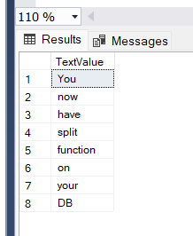

# Split to Rows
Split To Rows is a table valued function for SQL Server versions lower than 2016 compat. 130 that doesn't have STRING_SPLIT available to split strings into rows. 

# How to Install?
Just [download the source code](https://github.com/rtanakabr/split-to-rows/blob/main/FnSplitToRows.sql), run on your database to create the function.

# How to use it?
Use it on a SELECT statement.
```
SELECT
	TextValue
FROM
	FnSplitToRows(';', 'You;now;have;split;function;on;your;DB')
```
And this is the result:<br/>

